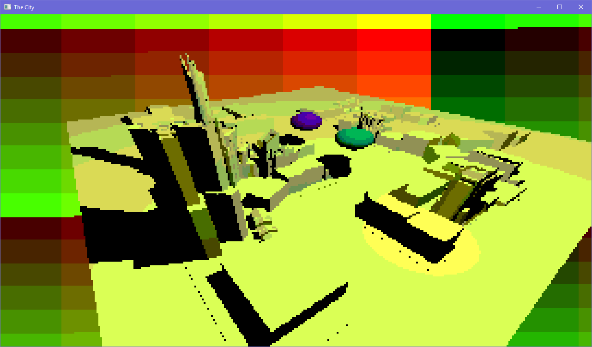

# The City
A low-res, 256 color ray-traced scene with FPS controls.

Sadly not very useable at the moment, since the ray tracing is not very efficient. See [ncollide issue #88](https://github.com/sebcrozet/ncollide/issues/88).

Proof of concept status. Horrible code. Project is paused until ray-tracing can be made faster. See above issue.